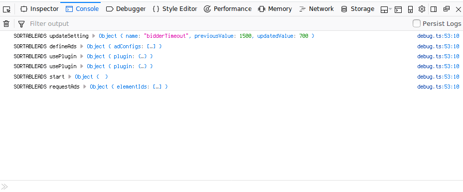

# Development Tips

---

## Turn On Debug Flag

You can pass in query parameters to enable debugging for Ads Manager.

* `?sortableads_debug=true`
* `?sortableads_debug=false`
* `?sortableads_debug=true_storage`
* `?sortableads_debug=false_storage`

Ads Manager will look for the query string to determine whether or not to enable/disable debugging. The _storage variants will cause your selection to be persisted through LocalStorage. Afterwards, if the query string is not passed, Ads Manager will look under LocalStorage to check the persistant value for debugging.

Once debugging is turned on, Ads Manager will perform logging when certain events occur by default. You can filter for only logging statements by the prefix **SORTABLEADS**.

To add logging on additional events, use the addEventListener method with the following events:

| Event                     | Description                                                                    |
|---------------------------|--------------------------------------------------------------------------------|
| eventListenerError        | There was an error in an event handler.                                        |
| error                     | The API was not used as expected, and further behaviour may be undefined.      |
| warning                   | The API may have been used incorrectly, but further behaviour will be defined. |
| updateSetting             | An Ads Manager setting is changed.                                             |
| defineAds                 | Start defining ads for all header bidders.                                     |
| requestAds                | Start requesting ads for all header bidders.                                   |
| destroyAds                | Start destroying ads for all header bidders.                                   |
| loadNewPage               | A new page is loaded.                                                          |
| usePlugin                 | A plugin is registered.                                                        |
| start                     | Start the header bidding process.                                              |
| noUnitDefined             | No ad units are defined.                                                       |
| requestUndefinedAdWarning | An undefined ad was requested.                                                 |
| requestBidsTimeout        | A header bidder timed out from initialization or sending bid requests.         |

Example of Default Output:

